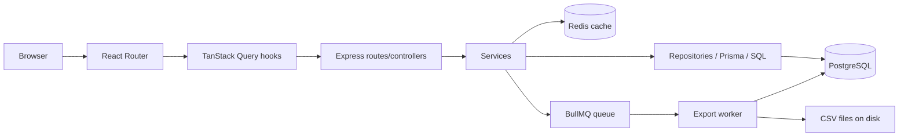

# System Map

## Repo Shape

This is a two-workspace JavaScript/TypeScript monorepo (`package.json:5-20`).

```text
repo/
  backend/      Express API, Prisma schema, services, repositories, worker
  frontend/     React app, role-aware dashboards, query hooks, routed pages
  docs/         Existing project docs
  docs/upskill/ Training curriculum (this module)
  .github/      CI workflow
```

## Ownership Map

| Area | Primary files | Owns | Must not own |
| --- | --- | --- | --- |
| UI shell | `frontend/src/app/router.tsx:25-66`, `frontend/src/layout/AppLayout.tsx:6-15` | Pages, route tree, role-gated navigation | Backend business rules |
| Frontend data layer | `frontend/src/api/client.ts:5-40`, `frontend/src/features/dashboard/hooks/useKpiSummary.ts:5-9` | Query keys, fetches, cache interaction | Durable authz decisions |
| API transport | `backend/src/app.ts:20-57`, `backend/src/modules/*/*.routes.ts` | URL surface, middleware composition | Heavy domain logic |
| Domain/services | `backend/src/modules/auth/auth.service.ts:25-219`, `backend/src/modules/exports/exports.service.ts:20-369` | Business rules, orchestration, side effects | Low-level HTTP formatting |
| Persistence | `backend/src/modules/*/*.repository.ts`, `backend/prisma/schema.prisma:11-192` | Prisma queries, SQL, data shape | UI concerns |
| Async work | `backend/src/jobs/export.processor.ts:9-38`, `backend/src/worker.ts:5-18` | Background execution | UI or router state |
| Shared cross-cutting code | `backend/src/middleware/*.ts`, `backend/src/shared/**/*` | Validation, errors, permissions, logging | Feature-specific policy unless truly shared |
| Tests | `backend/tests/**/*`, `frontend/src/test/**/*` | Regression coverage | Production logic |

## Public Interfaces

- Backend HTTP endpoints mounted in `backend/src/app.ts:45-52`
- Frontend route surface in `frontend/src/app/router.tsx:25-66`
- Prisma data contract in `backend/prisma/schema.prisma:11-192`
- Root commands in `package.json:9-20`
- CI contract in `.github/workflows/ci.yml:8-43`

## Private Internals

- Helpers like `backend/src/shared/utils/duration.ts:1-19`
- Cache key construction in `backend/src/cache/cacheKeys.ts:10-21`
- Query hooks and reusable chart components
- Internal service/repository boundaries inside feature modules

## Architecture Sketch



## Strong Existing Patterns Worth Teaching

- Thin controllers and route wiring (`backend/src/modules/auth/auth.controller.ts:5-40`)
- Explicit permission middleware (`backend/src/middleware/requirePermission.middleware.ts:7-18`)
- Backend-enforced metric filtering (`backend/src/shared/permissions.ts:54-67`)
- URL-backed dashboard filters (`frontend/src/features/dashboard/hooks/useDashboardFilters.ts:6-35`)
- Query cache keys derived from filter state (`frontend/src/features/dashboard/hooks/useKpiSummary.ts:5-9`)
- Cross-layer export workflow (`backend/src/modules/exports/exports.service.ts:20-212`)

## Weak Spots Or Areas To Investigate

- In-memory rate limiting is process-local and does not survive multi-instance deployment (`backend/src/middleware/rateLimit.middleware.ts:7-31`)
- Some summary endpoints still aggregate by loading pages of records rather than pure SQL aggregation (`backend/src/modules/events/events.service.ts:38-68`, `backend/src/modules/audit/audit.service.ts:52-91`)
- Queue depth is inferred from export job statuses in the database rather than from the queue backend itself (`backend/src/modules/monitoring/monitoring.repository.ts:34-47`)

## Verification Notes

- Inspected: `package.json`, `backend/src/app.ts`, `frontend/src/app/router.tsx`, schema, worker, queue, middleware, representative pages
- Uncertainty: no live request trace against a running backend in this pass
